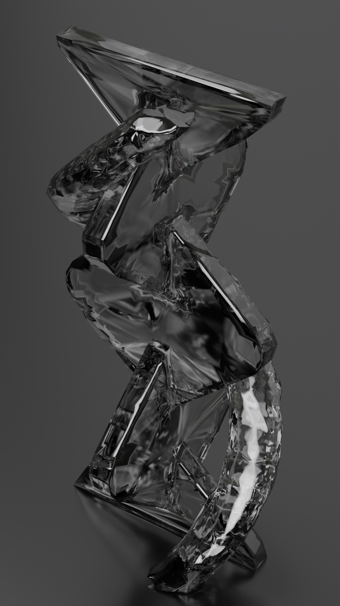
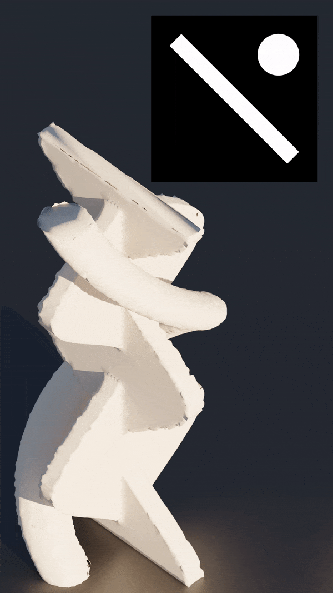
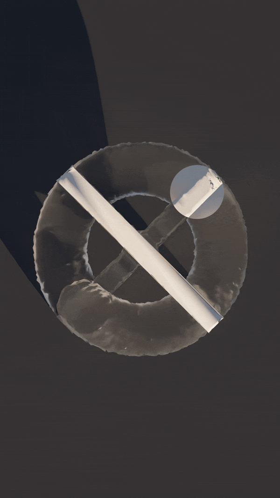
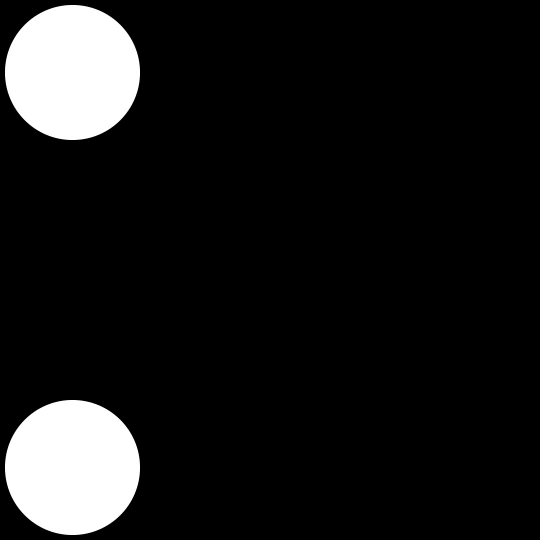

#Masterthesis #Blender #3DPrinting #Python

# T1MESCULPTURES

Time and space are constraint in our universe. Both are universal and impossible to comprehend.  
While we have limited time to explain space, time itself is forever as endless and mysterious as the universe. Our physical body will always be attached to snippets of time.
### _What if we could freeze a piece of time in space to get a fossil, reminiscent of our own mortal bodies? Maybe we cannot grasp infinity, but can we look at it from a finite perspective?_

Humans have been trying to conserve thoughts, art and history for as long as we exists, cave paintings, books and Kodak Moments® were all created to hold on to what has passed, but none of them actually display time _passing_.  
It's the context, a fading Polaroid, our inability to decipher symbols on the walls of ancient temples or photoplay music over old movies that show how time is passing. And while videos come close to depict movement in time, they are still just pictures piled on top of each other.

We know that time has passed between a football being kicked, flying through the air and landing in the net. We know that time has passed between our grandparents' wedding picture and the moment we're seeing it in an old photo album. But that's just because we have kicked a ball before and seen how our grandparents look now.

What if we could actually **visualize time passing**? Not just frames implying a change between them, but visualize the actual change in between, the actual passing moment.
## _Turning 2D video into 3D sculptures by using time as the third axis._

By using the movement between frames of a 2D video, the temporal dimension, as a third axis, it is possible to create “time sculptures”, depictions of passing time. Over time the animation and the changes in 2D geometry become frozen in space, thus creating a 3D sculpture of a fixed amount of time.

The difference between these sculptures and a simple 2D video in terms of their depiction of time is the interpolation between the frames. It enables us to accurately and precisely visualize the how time is passing, only limited by the quality of the algorithm and the size the sculpture will have in relation to the amount of time it depicts, as time becomes space.

## _The approach._

Opacity of a shape (or more precisely, pixel) in a 2D image is simulated by the amount of blending between it and whatever is behind it. For a black and white animation this means any pixel at any time can range between 0 and 255, or 0.0 and 1.0, "whiteness" in a video decoder.  
Physical objects of course can be transparent as well, but utilize special materials, surfaces and also light sources to achieve a "blend" with their background. This property in itself is incredibly complex. To achieve them algorithmically I would have to calculate transmission, reflection, refraction, and more, what would be beyond the scope of my thesis.

Hence, the 2D animations will be restricted to binary. Pixels are either white or black, nothing in between.  
I'm using After Effects to create animations and export them as individual frames, though my choice of program is preference alone and does not affect the algorithm. These frames are then parsed in a Python script, which extracts as much information as possible by comparing consecutive frames.  
Points, describing the shape(s) in each frame of the animation, are then connected between frames.  
Next, each frame is translated along the third axis in space. The points become the connected vertices and the connections become edges, both describing the 3D mesh.  
At last, I am using Blender to build faces of the mesh and ensure the 3D object is a manifold, so that it is ready to be 3D printed.

### Find out more about the algorithm of my first approach here: [Origin To Destination Approach](./algorithm/Origin%20To%20Destination%20Approach.md)

### I had found more success with my second approach: [Marching Cubes Approach](./algorithm/Marching%20Cubes%20Approach.md)

All approaches are tested with the following animation as it covers all edge case: circles, corners, inner holes and combination / separation of shapes.

### _Sizing of dimensions._

While the X and Y dimensions of the resulting sculpture from a video have a given ratio, the Z axis derived from the frames does not have a relative height to the size of the frames.

When applying the scaling factor to the temporal dimension, the following formula is used to get the height of each frame and its corresponding vertices:
`Zx = ((totaNumberOfFrames / FPS) * longestSide) * x`

A fixed height for a single "step" (1 second in time) is derived from the longest side of the frame (width or height). A pixel travelling linearly across the longer side of the frame within exactly one second will result in a 45 degree cylinder.

So far, this is in no way "logical". It's simply aesthically pleasing and still provides a rule: Eyer angle below 45 degrees means pixel(s) are "moving" faster than 1 second per longest side.

## _Time as a medium_

**Approaching time and space as eachother.**

- TIME becomes SPACE / SPACE becomes TIME

**Rethinking what time and space mean**

1. Shaping time to create a space and shping space to create time (in form of an animation)
   - Easy to use tool
     - Two modes: time to space & space to time
     - Mesh optimizer
     - Previews
2. Seeing space as time and time as space
   - Rethinking time: Getting a sense of its scale
   - Rethinking space: How a 3D object will look as 2D slices
   - Restriction: Using time to create space and vice-versa

### Other art forms shaping the understanding of time
- Animation curves
- Hartmut Rosa schrumpfende Weltkarte
- Charles Joseph Minard,  Napoleon’s disastrous invasion of Russia in 1812

---
## _*TO-DO*_

### Programming

- User Interface
  - 3D Viewer
    - [VTK](https://pypi.org/project/vtk/)
  - 2 tabs: timeview and spaceview
  - import / export
  - blender automation (?)
- Mesh optimazition
  - [PyMesh](https://pymesh.readthedocs.io/en/latest/)

### Thesis

