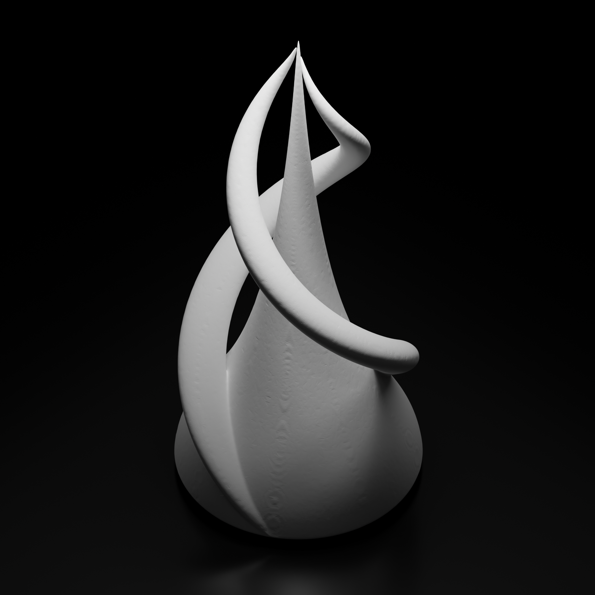
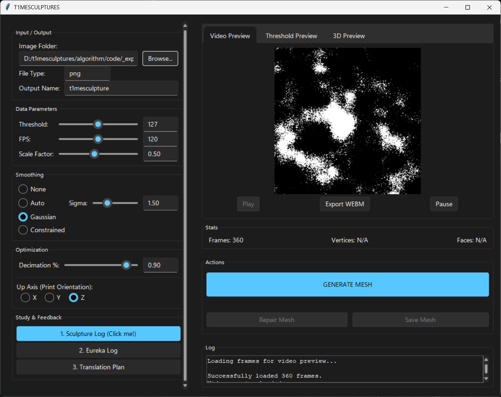
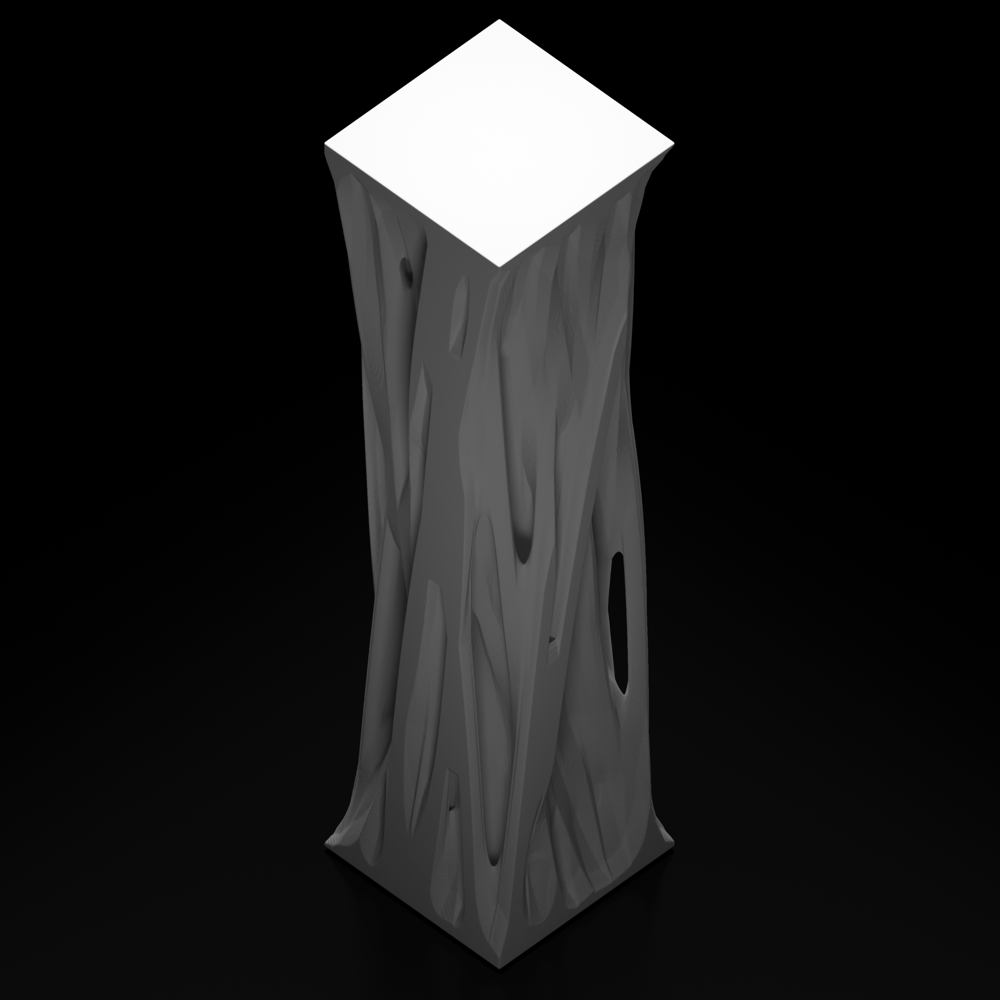
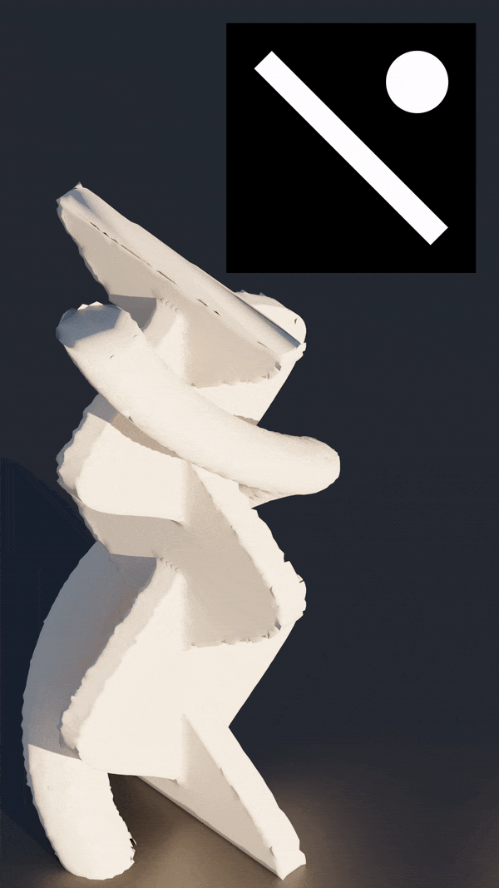
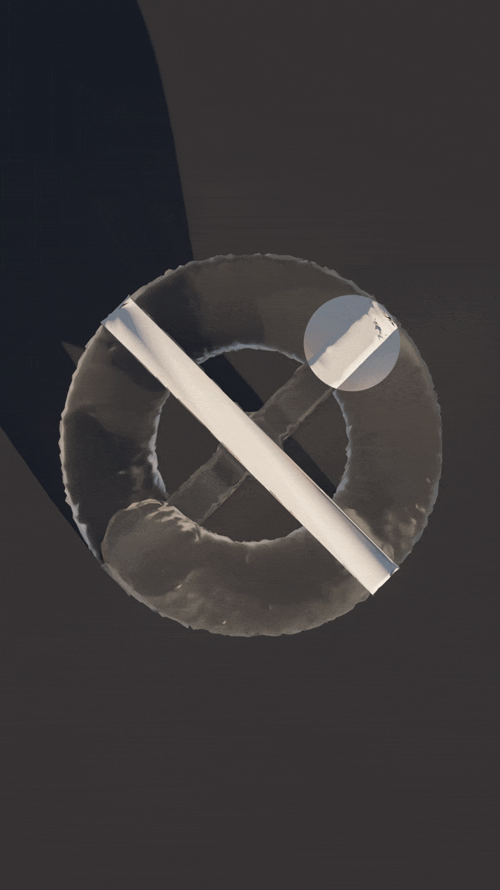
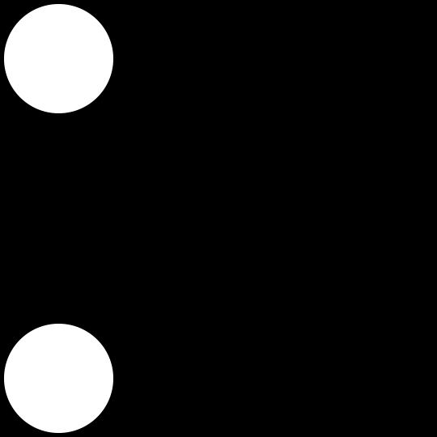
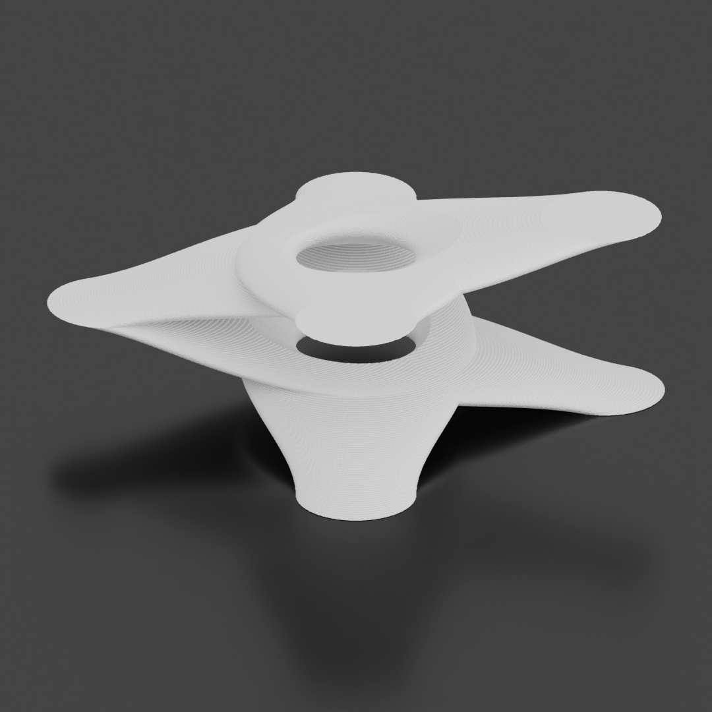

# T1MESCULPTURES

> [!IMPORTANT]
> Participating in the study?
> Read this document first and then head over to the [study guide](study.md).
> 
> Trouble with the installation and running the program? Read detailled instructions [here](#how-to-create-your-own-t1mesculpture).

Time and space are constraint in our universe. Both are universal and impossible to comprehend.  
While we have limited time to explain space, time itself is forever as endless and mysterious as the universe. Our physical body will always be attached to snippets of time.

### _What if we could freeze a piece of time in space to get a fossil, reminiscent of our own mortal bodies? Maybe we cannot grasp infinity, but can we look at it from a finite perspective?_

## Project Website showing my T1MESCULPTURES: [t1mesculptures.maltehillebrand.de](https://t1mesculptures.maltehillebrand.de/)

Humans have been trying to conserve thoughts, art and history for as long as we exists, cave paintings, books and Kodak Moments® were all created to hold on to what has passed, but none of them actually display time _passing_.  
It's the context, a fading Polaroid, our inability to decipher symbols on the walls of ancient temples or photoplay music over old movies that show how time is passing. And while videos come close to depict movement in time, they are still just pictures piled on top of each other.

We know that time has passed between a football being kicked, flying through the air and landing in the net. We know that time has passed between our grandparents' wedding picture and the moment we're seeing it in an old photo album. But that's just because we have kicked a ball before and seen how our grandparents look now.

What if we could actually **visualize time passing**? Not just frames implying a change between them, but visualize the actual change in between, the actual passing moment.

## _An app for time to space conversion._

With TKinter I created a simple GUI to process frames of a 2D animation, threshhold them into binary masks to be connected, use marching cubes for mesh generation from these masks and then ensure that the generated mesh is manifold for 3D printing. 

You can find the current implementation under [algorithm/code/app](./algorithm/code/app).

### How to create your own T1MESCULPTURE

0. **[Download the latest release](https://github.com/etlaM21/t1mesculptures/releases) for your operating system: 
**

---

#### **Windows Installation**

1. **Unzip the file:**
   - Locate the downloaded `.zip` file.
   - Right-click it and select **Extract All...**
   - Click **Extract**.
   - *⚠️ Important:* You must extract the folder first. Do not run the app directly from inside the ZIP file.

2. **Run the App:**
   - Open the new folder you just created.
   - Double-click `T1MESCULPTURES.exe`.

##### **Troubleshooting Windows**
> **"Windows protected your PC"**
> >
> If you see a blue window saying Microsoft Defender prevented the app from starting:
> 1. Click **More Info** (small text on the left).
> 2. Click the **Run Anyway** button.
> *(This warning appears because this is a custom research app and not a commercial product from the Microsoft Store.)*

---

####  **macOS Instructions**

> [!WARNING]
> Because this app is not on the App Store, **macOS will block it by default to protect you**. You must follow these specific steps to open it for the first time.

##### **Method 1: The "Right-Click" Trick (Recommended)**
This is the fastest way to bypass the security warning.

1. **Unzip** the file (double-click `T1mesculptures-macOS.zip`).
2. **Right-Click** (or hold `Control` on your keyboard and click) the `T1mesculptures` app icon.
3. Select **Open** from the menu that pops up.
4. A dialog box will appear warning you about an "unidentified developer".
5. Click **Open**.

*Note: You only need to do this once. Next time, you can just double-click it.*

##### **Method 2: System Settings**
If Method 1 does not work:

1. Double-click the app to try and open it. Click **OK** when the warning appears.
2. Open your Mac **System Settings** (or System Preferences).
3. Go to **Privacy & Security**.
4. Scroll down to the **Security** section.
5. Look for a message saying *"T1mesculptures was blocked..."*
6. Click the **Open Anyway** button.

---

1. **Create a 2D animation using any tool you're comfortable with, in my case after Effects.**

- Make sure the animation is exported as individual frames, not a video format.
- Keep the resolution low: Every pixel is processed, 540x540x480 Frames means 139.968.000 pixels. You won't need high resolution for a smooth and detailed mesh, if we print a pixel as a millimeter, think about how detailled your sculpture with such "low" resolution already.
- Framerate ist king / queen. Smooth transitions between shapes are ensured by providing the algorithm with enough data to process such a smooth transition. Because the framerate also dictates the duration, you can use it to stretch or squash the resulting mesh. Read more about the [height calculation](#Sizing-of-dimensions).
- To keep a connection "going", threshholded pixels must share an overlap between frames. Randomly placed pixels each frame will not result in a continuous structure.

2. **Use the T1MESULPTURES app to generate a 3D mesh.**
- Enter the folder containing the image sequence, the images' filetype and an output name.
- The _Data Parameters_ section sets up the transformation of the animation into binary masks.
  - Use the threshhold to threshhold your video sequence as intended You can always preview your threshholding by looking at the 'Threshhold Preview' tab.
  - Enter your framerate.
  - Use an appropriate scale factor to resize a 1080x1080 animation to a 540x540 for example. This can help you should your machine not be able to handle all the generated voxels or if you want to iterate faster.
- The _Smoothing_ section smooths the voxels generated by the marching cubes algorithm. This helps create an overall more pleasing sculpture.
  - 'None' applies no smoothing.
  - 'Auto' automatically chooses a smoothing algorithm and parameters based on your input mesh, more precisely its resulting pointcloud. It often ends up being the **slowest way to smooth** your mesh.
  - 'Gaussian' smoothes the mesh by applying a gaussian blur to the pointcloud. It's the **fastet way to smooth** your mesh.
  - 'Constrained' iteratively smooths your mesh. It's the **most precise way**, but also **relatively slow**.
- Using _Optimization_ by decimating the mesh is highly recommended. **Don't be afraid to use high values like 90%.** As most of the resulting mesh generated by marching cubes often are just planar surfaces, a high decimation value helps reduce file sizes drastically.

3. **Export your T1MESCULPTURE.**
- Preview your mesh by looking at the '3D Preview' tab. The preview will open a new window.
- Check if your mesh is manifold, the program will tell you above the 'Save Final Mesh' button. If your mesh is not manifold and you intend to 3D print, press the 'Repair Non-Manifold Mesh' button to try to fix it.
- Press 'Save Final Mesh' to save your T1MESCULPTURE as an .stl object.

## _Turning 2D video into 3D sculptures by using time as the third axis._

By using the movement between frames of a 2D video, the temporal dimension, as a third axis, it is possible to create “time sculptures”, depictions of passing time. Over time the animation and the changes in 2D geometry become frozen in space, thus creating a 3D sculpture of a fixed amount of time.

The difference between these sculptures and a simple 2D video in terms of their depiction of time is the interpolation between the frames. It enables us to accurately and precisely visualize the how time is passing, only limited by the quality of the algorithm and the size the sculpture will have in relation to the amount of time it depicts, as time becomes space.

## _The approach._

Opacity of a shape (or more precisely, pixel) in a 2D image is simulated by the amount of blending between it and whatever is behind it. For a black and white animation this means any pixel at any time can range between 0 and 255, or 0.0 and 1.0, "whiteness" in a video decoder.  
Physical objects of course can be transparent as well, but utilize special materials, surfaces and also light sources to achieve a "blend" with their background. This property in itself is incredibly complex. To achieve them algorithmically I would have to calculate transmission, reflection, refraction, and more, what would be beyond the scope of my thesis.

Hence, the 2D animations will be restricted to binary. Pixels are either white or black, nothing in between.  
I'm using After Effects to create animations and export them as individual frames, though my choice of program is preference alone and does not affect the algorithm. These frames are then parsed in a Python script, which extracts as much information as possible by comparing consecutive frames.  
Points, describing the shape(s) in each frame of the animation, are then connected between frames.  
Next, each frame is translated along the third axis in space. The points become the connected vertices and the connections become edges, both describing the 3D mesh.  
At last, I am using Blender to build faces of the mesh and ensure the 3D object is a manifold, so that it is ready to be 3D printed.

### Find out more about the algorithm of my first approach here: [Origin To Destination Approach](./algorithm/Origin%20To%20Destination%20Approach.md)

### I had found more success with my second approach: [Marching Cubes Approach](./algorithm/Marching%20Cubes%20Approach.md)

All approaches are tested with the following animation as it covers all edge case: circles, corners, inner holes and combination / separation of shapes.

### Read more about the current implementation: [algorithm/README.md](./algorithm/README.md)

### _Sizing of dimensions._

While the X and Y dimensions of the resulting sculpture from a video have a given ratio, the Z axis derived from the frames does not have a relative height to the size of the frames.

When applying the scaling factor to the temporal dimension, the following formula is used to get the height of each frame and its corresponding vertices:
`Zx = ((totaNumberOfFrames / FPS) * longestSide) * x`

A fixed height for a single "step" (1 second in time) is derived from the longest side of the frame (width or height). A pixel travelling linearly across the longer side of the frame within exactly one second will result in a 45 degree cylinder.

So far, this is in no way "logical". It's simply aesthically pleasing and still provides a rule: Eyer angle below 45 degrees means pixel(s) are "moving" faster than 1 second per longest side.

_How the test animation is scaled as a sculpture_