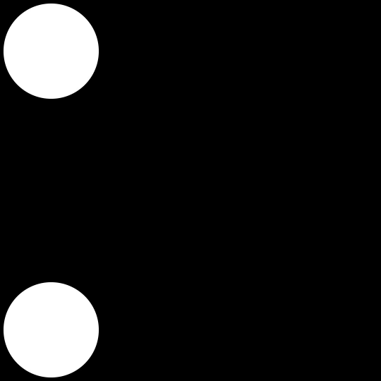

# Marching Cubes Approach

Marching Cubes is an algorithm by Lorensen et al. first implemented 1985.

It uses sclices of 2D images with positive and negative values to consctruct a 3D mesh by literally marching a cube through "slices" and connecting vertices.

This algorithm is perfectly suited for my use case. It also ensures a closed, manifold, mesh, which is even better as that is needed to 3D print a mesh.

OpenCV, Numpy and scikit-image are the libraries primarily used in this Python implementation.

## scikit-image marching cubes

To first test the feasibility of the algorithm, the [standard scikit-image implemenation of marching cubes](https://scikit-image.org/docs/stable/api/skimage.measure.html#skimage.measure.marching_cubes) was used.

This results in a [decent model](./marchingcube_01.stl). The only downside to this is the blocky output. There is no smoothing between layers.

