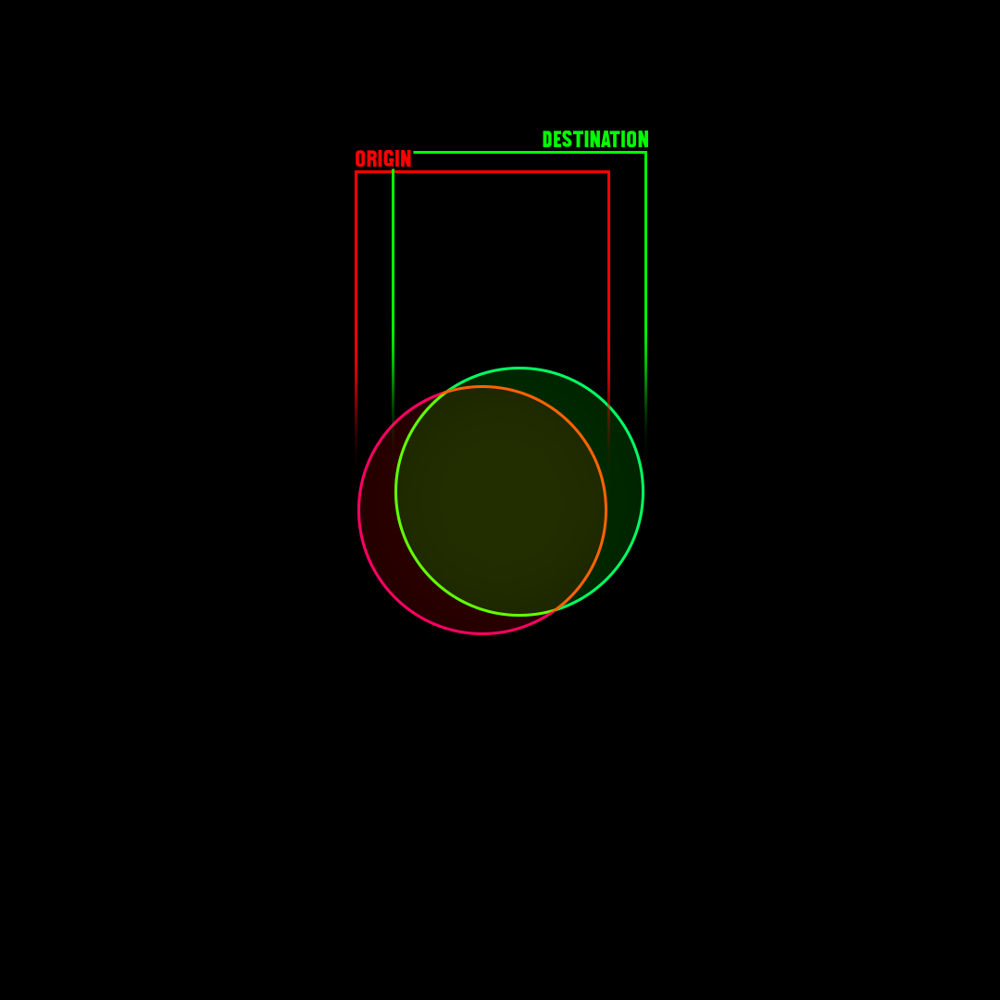
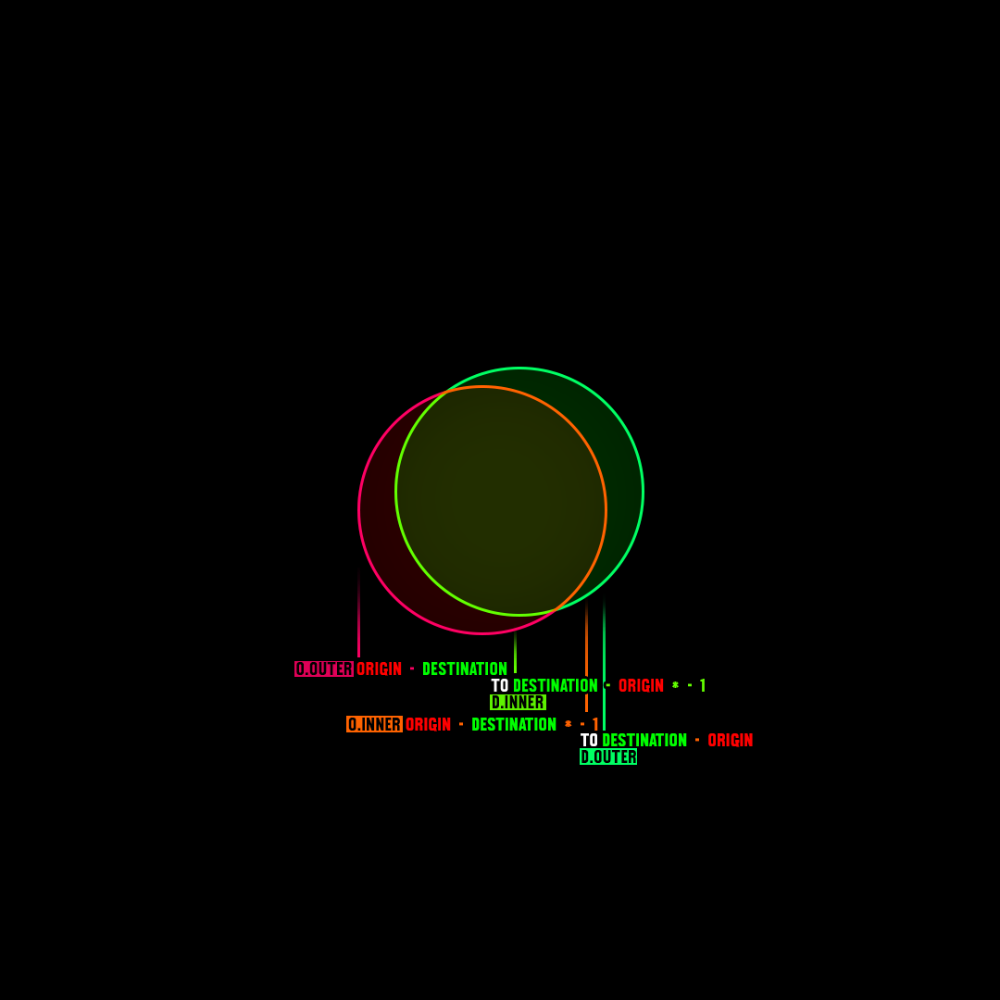
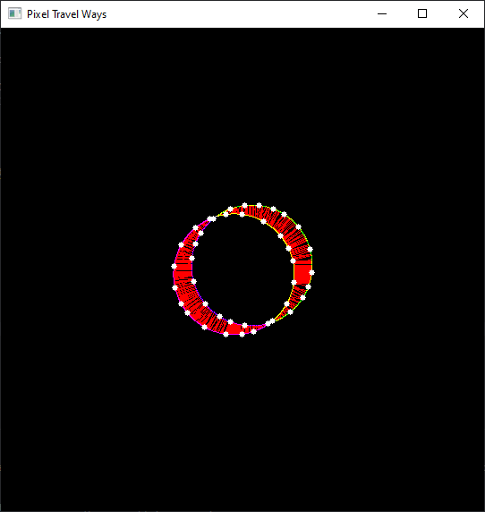

This algorithmic approach to detecting corner movement between frames uses an origin and a destination frame to calculate differences between them.

OpenCV and Numpy are the libraries primarily used in this Python implementation.

The approach compares two frames, **an origin and a destination frame**. The destination is the frame following the origin. When both frames are overlaid, an **intersection occurs where nonzero pixels are shared**. We can assume this, because any frame has to share at least one pixel with the next one – _if there is one_ – in order to form a physically (valid) connection in 3D-space.

Of course, there are **two exceptions to this rule**:
1. Pixels appearing in the destination frame without any shared pixels in the origin and creating a connection only later with a pixel that is connected to at least one pixel since frame 0.
2. Pixels disappearing in the destination, thus leaving the origin frame's pixels with no intersection and not establishing any connection with the destination.

This assumption is important to properly connect vertices from the detected corners later on.
Else, calculating a “direction” in which pixel are moving without any other kind of restriction or passing more data with the frames, e.g. animation data, becomes a seemingly impossible task.

## Movement between consecutive frames

To get an idea how pixels are moving between frames, consecutive frames are overlaid and contours are masked. This will lead to pixels _intersecting_, the _inner pixels_, and pixels which _don't intersect_, the _outer pixels_. Both can be extracted for the origin and destination frame.

This information tells us already more about the movement of pixels:
1.  Pixels on the **_Origin.outer_** contour will need to move to the **_Destination.inner_** contour
2.  Pixels on the **_Origin.inner_** contour will need to move to the **_Destination.outer_** contour

Now the shortest way of each pixel on both of the Origin contours to a pixel on its respective destination contour is calculated and saved.
**The process is then reversed** and also done from the Destination contour back to its respective Origin contour. Each pixel connected on the origin contour is then compared and the longest distance stays.
This ensures that _every_ pixel on the destination contour is looked at and might be connected, as a longer distance (of the shortest distance calculations for all four contours), means that a pixel hasn't been connected previously, but has to be used as it is the proper movement of the pixels.

_You can see the result of this calculation in the pixel movement here as red lines._

## Connecting vertices

Once the movement of the pixels is calculated, it can be used to give information on how the vertices have to be connected.
Generally, a vertex has **at least** _three_, but in most cases _four_ connections:
1. Its previous neighbor vertex on the same contour
2. Its next neighbor vertex on the same contour
3. The vertex it has to connect to on the Destination contour _(does not apply for the very last frame without a destination)_
4. The vertex it was connected to from a previous calculation, where the now Origin contour was a Destination contour _(does not apply for the very first frame)_

To find out which vertex on the Destination contour a vertex has to connect to, the pixel movement on the contour is used for a direction.
Starting with the pixel shared with the Vertex on the Origin contour, the direction is extracted from the pixel's movement vector.
Now, all other pixels' vectors on the contour are added to the vector and normalized, until we end up at either the previous or the next vertex, or the end or beginning of the contour. The factor of the addition of vectors becomes lower the further we are away from the original Vertex's pixel position. This ensures that the pixels' movement closer to the vertex has more meaning.

Afterward, a ray is shot from the vertex in the direction until the Origin contour is hit. From there, the closest vertex on the contour is taken and connected.