## _Time as an artistic medium_

**Approaching time and space as eachother.**

- TIME becomes SPACE / SPACE becomes TIME

**_Interesting dynamic:_ Create a time sculpture and then shape it properly afterwards to convey a certain feeling (how time felt), then translate it back into an animation.**

**Rethinking what time and space mean**

1. Shaping time to create a space and shping space to create time (in form of an animation)
   - Easy to use tool
     - Two modes: time to space & space to time
     - Mesh optimizer
     - Previews
2. Seeing space as time and time as space
   - Rethinking time: Getting a sense of its scale
   - Rethinking space: How a 3D object will look as 2D slices
   - Restriction: Using time to create space and vice-versa

**Evaluating users**

- interviews
- comparing artworks created

**Talk to experts**

- sociology professors
- psychlogy professors
- therapeutic / behavorial professors

### Research Issue

1. Synchronisation: Gleichzeitigkeit und "gleichortigkeit" führt zur _Desynchronation_; Fomo, Überförderung, Unsicherheit.
     - _Kann die Restriktion auf das Arbeiten mit "einer Zeit" zur Resynchronisation führen?_
2. Welche Implikation hat das kulturelle Zeitverstädnis auf die künstlerische Arbeit?
3. Wie verändert sich künstlerisches Arbeiten, wenn eine Transferleistung (Zeit zu Raum, Raum zu Zeit) im Urpsrung des Prozesses steht? -> Was passiert, wenn das Resultat einer Arbeit abhängig von Vorstellung der Implikationen der Vorarbeit ist? (anderes Beispiel: Creative Coding)
4. Können Zeitskulpturen eine plastische Fortführung des Impressionismus sein?
    - _Falls nein:_ Wo ordnen sie sich ein zwischen Expressionismus und Konstruktivismus?

### Other art forms shaping the understanding of time

#### Data Visualization

- Animation curves

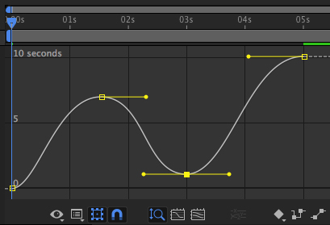

- Hartmut Rosa schrumpfende Weltkarte

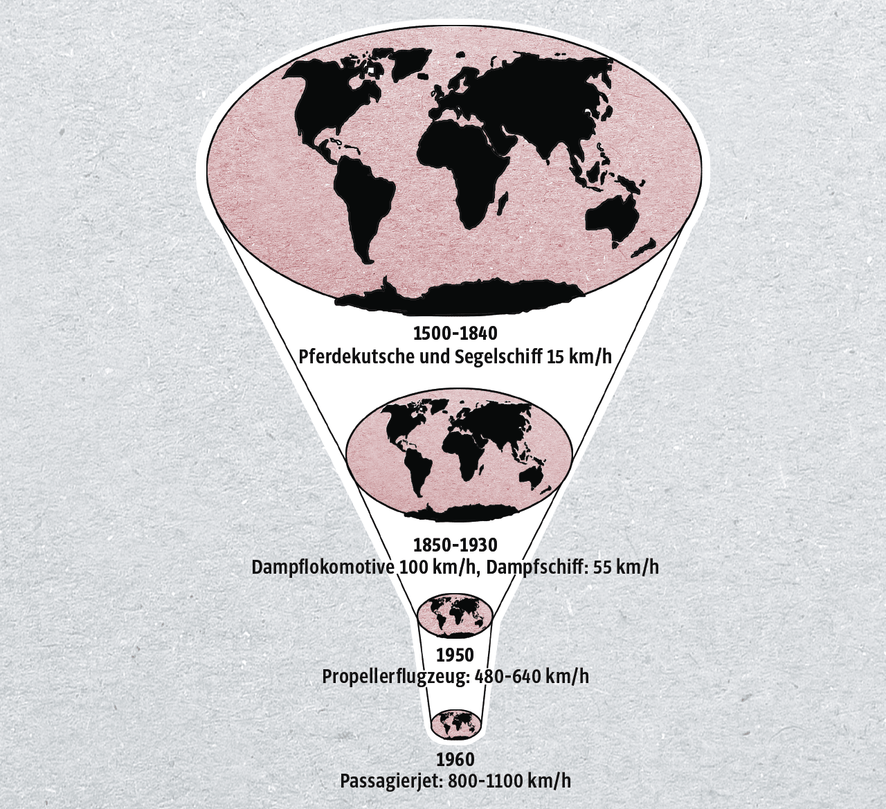

- Charles Joseph Minard,  Napoleon’s disastrous invasion of Russia in 1812

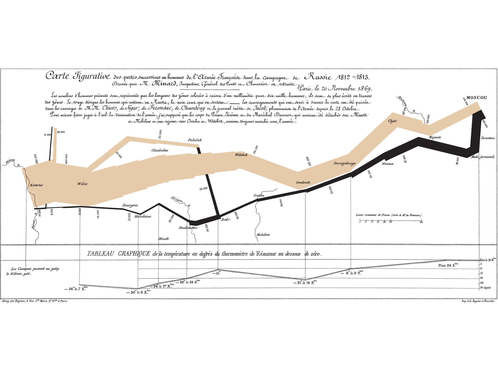

### Art

- Jean Morin, "Memento Mori", first half of 17th century

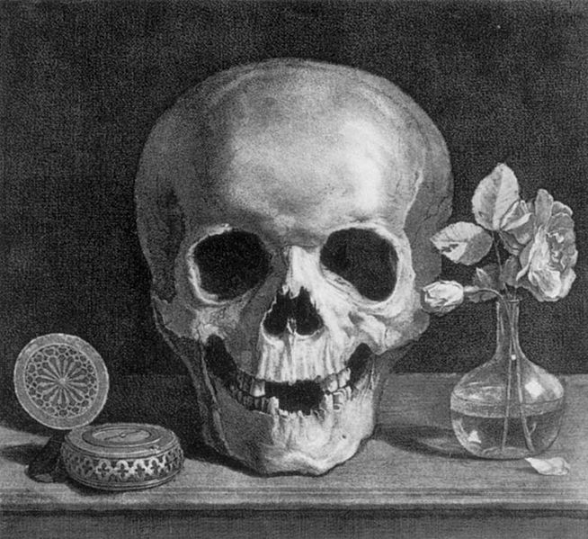

- Evert Collier, "Vanitas, Still Life with Books and Manuscripts and a Skull", 1663

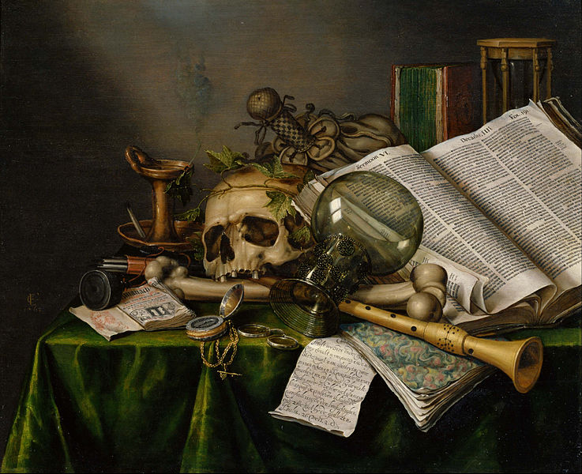

- Piedra del Sol, 1502 - 1520 (_sun calendar_)

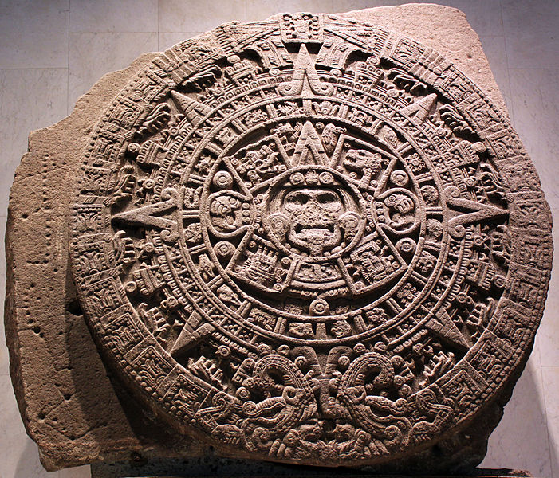

- Wassily Kandinsky, "Yellow — Red — Blue", 1925 (_idea of motion on a canvas_)

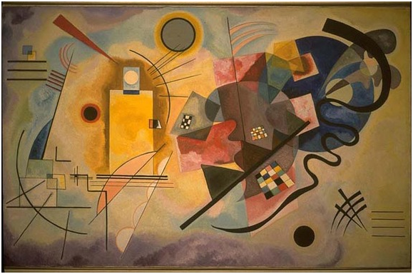

- Umberto Boccioni, "Unique Forms of Continuity in Space", 1913 

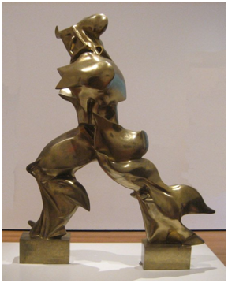

- Jackson Pollock, "Number 34", 1949 (_action painting_)

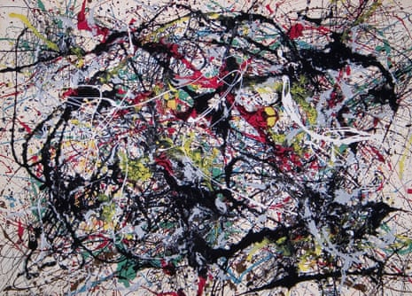

- [Len Lye, "Witch Dance", 1965](https://www.youtube.com/watch?v=QBICitKpYNQ) (_kinetic sculptures_)
- Edgar Degas, "Three Dancers II", 1898

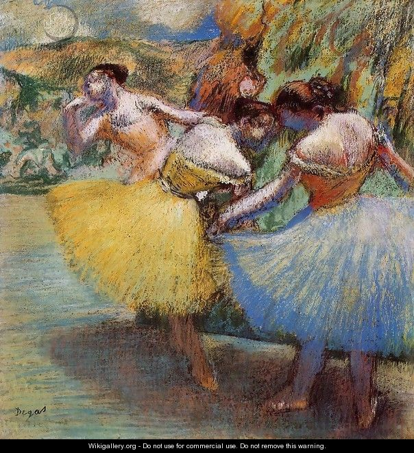

- Etienne-Jules Marey, multi-exposed Chronophotograph, 1890 College de France

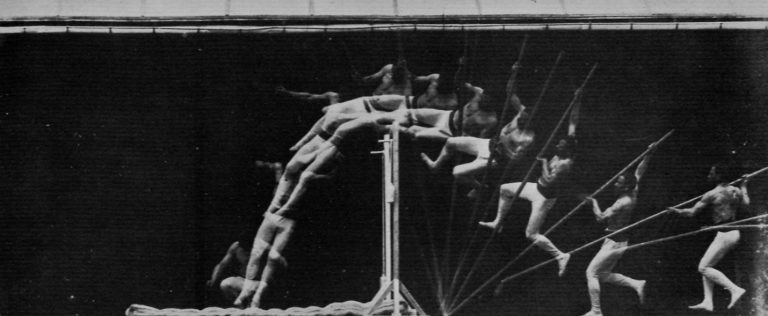

- Eadweard Muybridge, studies of human and animal locomotion. Athlete, Standing Leaps, 1879
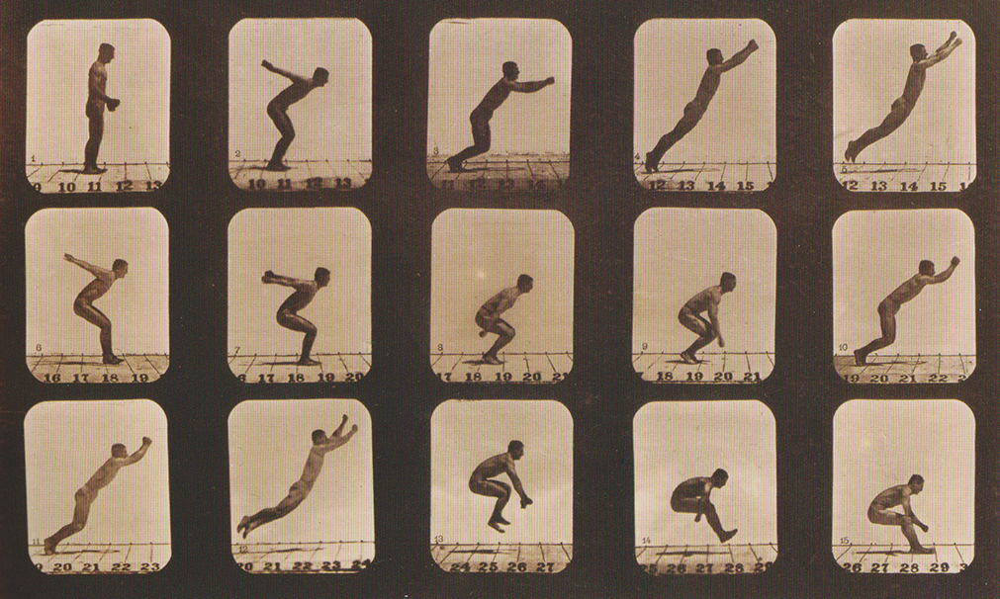

-> _DIFFERENCE:_ All are implying time by trying to depict movement (or actually moving), none _show_ time!

#### Contemporary Art

- John Salvest, "Newspaper Columns", 1997

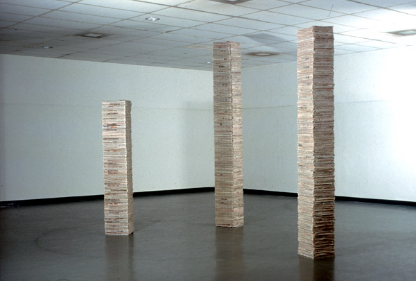

- John Salvest, "Reliquary", 1991- 

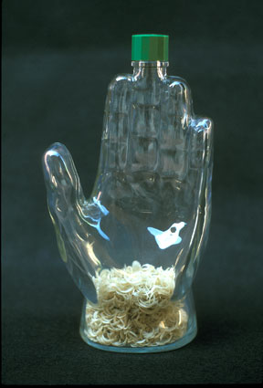

- Robert Farber, "055", 1981 From A Collaboration with Time-Deterioration Series

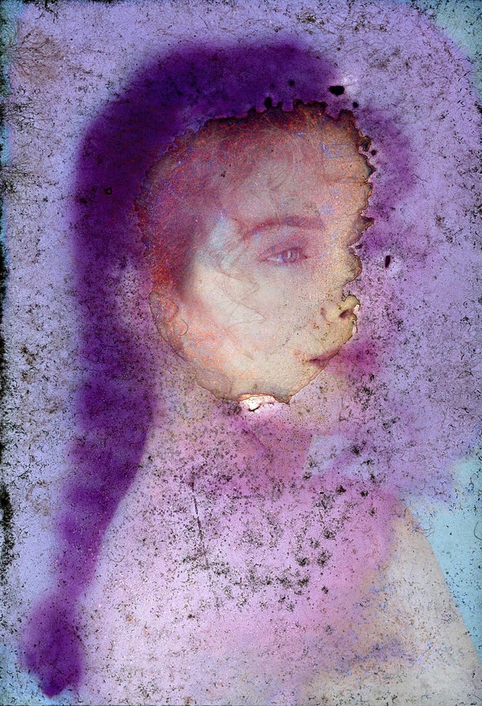

- Kellyann Burns, "3:24 PM 8/14/17"

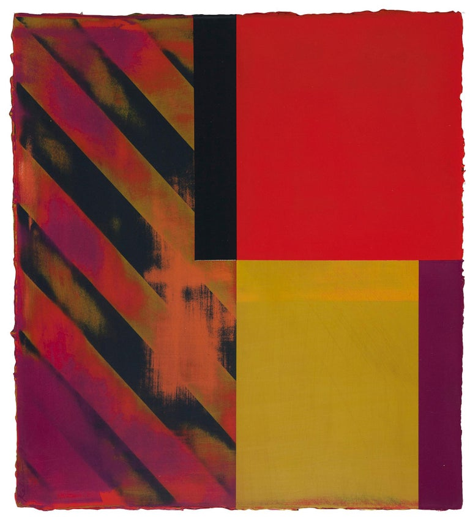

- Johanna Burke, "MAKE TIME", 2018

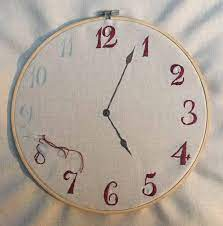

- [Cindy Sherman](https://en.wikipedia.org/wiki/Cindy_Sherman)

- Jean-Remy von Matt, ["The Lifetime Sculptures"](https://www.lifetimesculptures.com/), 2023 (?)

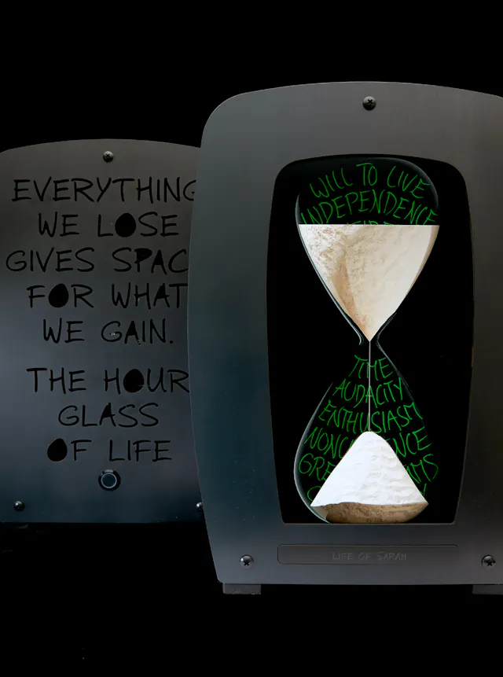

#### Movies

- [**Memento** by Christopher Nolan](https://en.wikipedia.org/wiki/Memento_(film))
- [**Inception** by Christopher Nolan](https://en.wikipedia.org/wiki/Inception)
- [**Tenet** by Christopher Nolan](https://en.wikipedia.org/wiki/Tenet_(film))
- [**Enter the Void** by Gaspar Noe](https://en.wikipedia.org/wiki/Enter_the_Void)
- [**In Time** by Andrew Nicool](https://en.wikipedia.org/wiki/In_Time)
- [**Source Code** by Duncan Jones](https://en.wikipedia.org/wiki/Source_Code)
- [**Back To The Future** by Robert Zemeckis](https://en.wikipedia.org/wiki/Back_to_the_Future)
- [**Frequency** by Gregory Hoblit](https://en.wikipedia.org/wiki/Frequency_(2000_film))
- [**Time Lapse** by Bradles D. King](https://en.wikipedia.org/wiki/Time_Lapse_(film))
- [**Edge of Tomorrow** by Doug Liman](https://en.wikipedia.org/wiki/Edge_of_Tomorrow)
- [**Looper** by Rian Johnson](https://en.wikipedia.org/wiki/Looper_(film))

#### Music

- [Moor Mother](https://en.wikipedia.org/wiki/Moor_Mother)